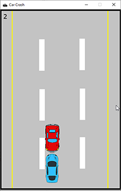

# Pygame Tutorials

## Pygame-ce

I am switching to [pygame-ce](https://pyga.me/). It is a drop-in replacement for pygame. You do not need to change your code.

It aims to offer more bug fixes, improvments, and extra features.

You install the library in the traditional way. You will want to uninstall pygame first.

```python
pip uninstall pygame
pip install pygame-ce
```

## Car Crash

A driving game tutorial based on a Car Crash tutorial I found somewhere. The assets are the same, the code is completely different. The first iteration starts as a script. The project ends in OOP.



## Games

- Car Crash
- Flappy Bird
- Pong
- Tractor Pong

### Purpose

I am an Information Technology Instructor at [Western Nebraska Community College](https://www.wncc.edu). I teach Information Technology, CyberSecurity and Computer Science. Best job ever!

This is a collection of PyGame tutorials for my Computer Science classes at Western Nebraska Community College.

Visit our Facebook page: [Facebook WNCC IT Program](https://www.facebook.com/wnccitprogram/)

### License
<a rel="license" href="http://creativecommons.org/licenses/by-nc-sa/4.0/"></a><br />This work is licensed under a <a rel="license" href="http://creativecommons.org/licenses/by-nc-sa/4.0/">Creative Commons Attribution-NonCommercial-ShareAlike 4.0 International License</a>.

Copyright (c) 2024 William A Loring
